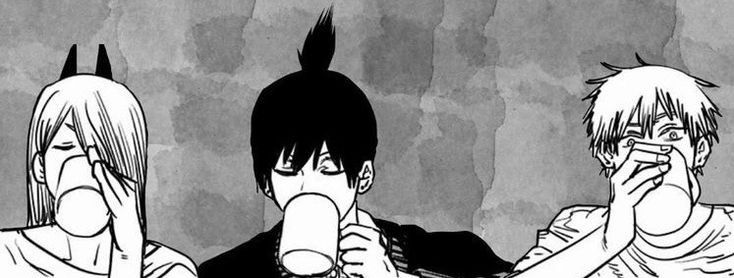

<!-- ANIME BANNER -->
<!-- 

  

 -->

<picture>
  <source media="(prefers-color-scheme: dark)" srcset="https://raw.githubusercontent.com/farasalgh/farasalgh/output/pacman-contribution-graph-dark.svg">
  <source media="(prefers-color-scheme: light)" srcset="https://raw.githubusercontent.com/farasalgh/farasalgh/output/pacman-contribution-graph.svg">
  
</picture>

###

###
